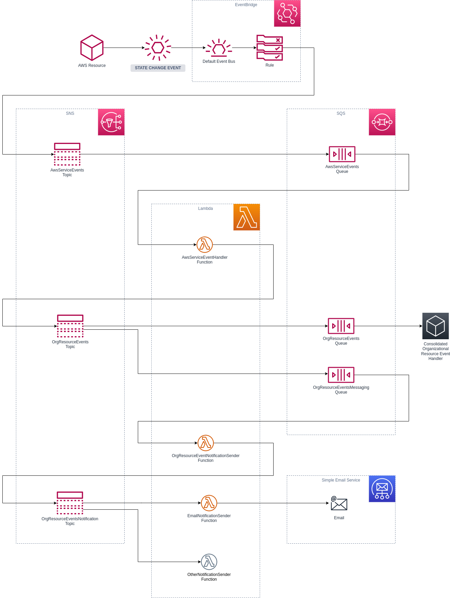

# aws-event-messaging-example

An example project to illustrate an AWS EventBridge based solution to send notification on AWS Service Events

> _**Important Notice**_
>
> These examples are just that: examples. Please be aware that you may incur costs when deploying these examples. Further be aware that these examples make no assumptions about your information security policies and if you are evaluating these for official use, you will first need to adapt these examples to suite your specific needs.

Specifically, this example will notify on EC2 state change events. You can test the solution by creating an EC2 instance, and then stop and start and even terminate the instance. If you follow all the steps correctly, you will see the following:

* E-Mails in your inbox
* A message buildup in the SQS queue called `OrgResourceEventsQueue` - this is by design.

# Design



# Technology Stack

* AWS Cloud Services - you will need at least one active account where you are the administrator or have administrative rights.
* [AWS SAM](https://aws.amazon.com/serverless/sam/)

Installation instruction is available in the [AWS Documentation](https://docs.aws.amazon.com/serverless-application-model/latest/developerguide/serverless-sam-cli-install.html) for Linux, Windows and macOS.

Any further instructions here assumes a Linux based system using BASH or ZSH (tested on ZSH).

# Deployment

Assuming you are roughly familiar with AWS SAM, the following commands can be issued to deploy the stacks:

```shell
sam build && sam deploy --no-confirm-changeset
```

Post deployment, for any testing to work, you will need to set the relevant e-mail addresses for the Lambda functions `EmailNotificationSenderF` using the AWS Console. Navigate to the function and go to `Configuration` and `Environment variables`. Set the two environment variable to one e-mail address each. Multiple e-mail addresses will require a code change.

_**Note**_: If you are in an [SES Sandbox](https://docs.aws.amazon.com/ses/latest/dg/request-production-access.html) you will need to set the environment variables with verified e-mail addresses.

# Cleanup

You can manually delete the AWS CloudFormation stack called `aws-event-messaging-stack`.
